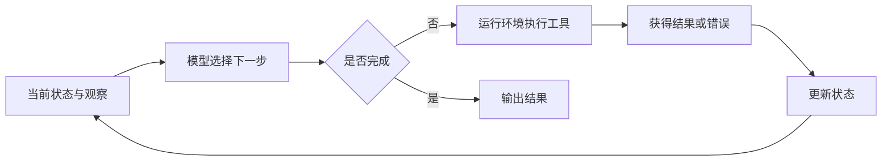

# Agent Workshop 历史交互总结

来源：[agent大纲.txt](agent大纲.txt)、[demo分析.txt](demo分析.txt)。

本文合并两份记录中的重复讲义，整理课程目标、概念主线、Demo 比较与讨论进展，省略聊天界面杂项和大段 LaTeX 排版代码。文中的方案与工具选型来自历史讨论，不代表已经实现或验证。

## 1. 需求与讨论结果

### 用户已明确的要求

- 面向商科同学讲解从零开始搭建 Agent，应用背景为 PhD Workshop。
- 讲义采用论文／文字稿形式，可以插入示意图；此前 Beamer PPT 编译出错后，用户明确要求放弃这种讲义形式。
- 希望比较适合现场演示的 Demo，并说明需要哪些工具、哪些可用现成能力、哪些需要自己编写。
- 最后一轮重点要求分析三个候选：主题 PPT 制作、类似 Claude Code 的代码 Agent、论文撰写／修改 Agent。

### GPT 在记录中提出的建议

- 按约 **60 分钟**组织课程，以同一任务逐步升级，讲清 `API → 结构化输出 → 工具调用 → Workflow → Agent Loop`。
- 先手写最小 Agent Loop，再讲状态、记忆、规划、反馈，最后介绍框架提供的工程支持。
- Demo 推荐经历了三个阶段：原讲义中的文献调研 → 面向商科的商业调研及 CSV 分析 → 最后一轮的 **PPT 制作主线 + 极简代码修复 + 论文修改拓展**。
- 最后一轮建议尚未得到用户明确确认，不能视为已定稿的 Demo 方案。

“讲义不用 PPT”和“用制作 PPT 作为 Agent 的任务”是两个不同层面：前者是授课材料形式，后者是演示系统的输出产物。

## 2. 第一份记录：课程大纲与讲义形式

### 2.1 从 Beamer 改为文字讲义

记录开头主要处理两类编译问题：

| 现象 | 历史回复中的诊断与建议 |
| --- | --- |
| `Runaway argument`、`lstlisting` 被异常结束、连锁括号错误 | 含 `lstlisting` 的 Beamer frame 漏加 `[fragile]`；检查所有代码页 |
| 只生成 3 页，出现 `File ended while scanning ...` | 怀疑 fragile frame 的结束标记未被识别或复制内容损坏；检查 `\end{frame}` 并单独顶格书写 |

随后用户选择改成文字讲义。GPT 提供了 `ctexart` 文档，建议用 XeLaTeX 编译，每节包含讲解大纲、正文、代码／示意图和演讲备注。记录中没有附实际编译验证结果。

### 2.2 教学目标

让听众理解一个普通 LLM 应用如何发展为能够调用工具、维护状态并根据反馈行动的系统。

核心教学抽象是：

> **Agent ≈ LLM + Tools + State + Loop。**

记忆、规划、反思和多智能体协作是在此基础上的增强。这个表达是用于教学的简化模型，并非统一的学术定义。

### 2.3 原讲义的时间分配

| 内容 | 建议时长 | 讲解重点 |
| --- | ---: | --- |
| LLM API | 6 分钟 | 请求、消息、上下文与响应 |
| Structured Output | 4 分钟 | 用 JSON 等结构表达程序可读取的决策 |
| Tool Calling | 8 分钟 | 模型选择工具，运行环境执行工具 |
| Workflow | 5 分钟 | 预先编排多个步骤 |
| Agent Loop | 10 分钟 | 根据观察结果动态决定下一步 |
| State / Memory | 6 分钟 | 当前任务状态与信息保存、检索 |
| Planning / Reflection | 8 分钟 | 任务拆解、重新规划、反馈修正 |
| Multi-Agent / Framework | 6 分钟 | 分工协作与工程基础设施 |
| Failure / Evaluation / 总结 | 7 分钟 | 失败模式、执行约束与评价指标 |
| **合计** | **60 分钟** | |

这是原讲义的建议安排；记录没有提供采用最后一轮三个 Demo 后重新分配的完整时间表。

## 3. 课程概念主线

### 3.1 API：从一次模型调用开始

最简单的形式是“输入 → LLM → 输出”。实际请求一般包含指令、用户问题、上下文和历史消息。

原讲义用 `8173 × 9271` 引入计算器：模型输出计算答案，并不意味着它实际执行了计算工具。此处重点是区分文本生成与外部执行，不深入 Transformer、Attention 等模型原理。

### 3.2 结构化输出：让程序读懂决策

将“我认为应该使用计算器”改为包含动作和参数的结构：

```json
{
  "action": "calculator",
  "arguments": {
    "expression": "8173 * 9271"
  }
}
```

程序由此能够解析模型的选择。结构化输出本身仍不等于 Agent，也不意味着动作已经执行。

### 3.3 工具调用：模型与运行环境分工

完整链路为：

```text
用户任务 → 模型生成工具调用 → Runtime 执行工具
        → 工具结果返回模型 → 模型继续处理或回答
```

工具可以是计算器、网页搜索、文件读写、数据库查询、Python 执行、论文检索等。模型决定调用什么、传入什么参数；外部程序负责实际执行并返回结果。

原记录使用 `eval()` 简化计算器示例，同时指出它不适合处理真实系统中的不可信输入，需要验证与执行限制。

### 3.4 Workflow 与 Agent Loop：谁决定下一步

| 维度 | Workflow | Agent Loop |
| --- | --- | --- |
| 流程控制 | 由程序预先定义路径与规则 | 模型根据当前状态和观察选择后续动作 |
| 文献调研示例 | 搜索 → 阅读 → 提取 → 总结 | 发现规划方向资料不足 → 补充搜索 → 继续阅读 |
| 优势 | 稳定、易调试、成本较可预测 | 可以适应信息缺口和执行反馈 |
| 代价 | 对未覆盖情况适应性有限 | 可能出现循环、目标漂移、成本增加 |

教学时的关键问题是：**下一步动作是谁决定的？** 多步骤、复杂输出或自动生成 PPT，都不足以单独证明系统采用了 Agent Loop。流程明确的任务仍可能更适合 Workflow。



最小循环可概括为：读取状态 → 模型选择动作 → 执行 → 收集结果 → 更新状态 → 再次决策，并设置步数上限等停止条件。

### 3.5 State 与 Memory：管理任务信息

| 概念 | 含义 | 示例 |
| --- | --- | --- |
| Context | 某次模型调用实际看到的信息 | 指令、问题、历史消息、工具结果 |
| State | 当前任务的结构化状态 | 目标、已读论文、未解决问题、执行进度 |
| Working Memory | 本次任务暂时需要的信息 | 中间总结、当前计划、已完成事项 |
| Long-term Memory | 跨阶段或跨任务持久保存的信息 | 文件、数据库、知识库中的记录 |

向量数据库只是实现存储与检索的一种方式。记忆机制需要决定保存什么、检索什么、何时总结和遗忘；无限追加聊天历史会带来上下文、成本与延迟问题。

### 3.6 Planning 与 Reflection：规划和反馈修正

- **ReAct**：决策、行动与环境观察交替进行；重点是利用反馈继续决策，不在于是否展示内部推理文本。
- **Plan-and-Execute**：先拆解任务，再逐项执行；遇到新信息时调整计划。
- **Reflection / Critic**：形成“生成 → 评价 → 修改”的过程。

记录特别强调可验证反馈的价值，如测试失败、编译错误、计算结果和检索来源。模型自我评价并不天然可靠，论文文字“变得更好”也不如测试结果容易客观判断。

### 3.7 Multi-Agent 与 Framework

多智能体可采用 Manager–Worker 结构，由不同角色承担研究、编码和评审。其价值来自分工、信息隔离、并行执行或独立验证；单纯重复调用相同模型并不会自动带来有效协作。

框架主要补充最小循环以外的工程能力：状态管理、重试、超时、检查点、持久化、日志追踪、人工介入、权限和错误恢复。原记录列举 LangGraph、OpenAI Agents SDK、LangChain、AutoGen、CrewAI 等作为后续学习对象。

### 3.8 失败与评价

常见失败包括工具或参数选择错误、误读工具结果、目标漂移、无限循环、上下文膨胀和成本过高。原讲义建议配置步数、时间、Token、费用预算及工具范围等限制。

评价至少覆盖：任务成功率、工具调用准确率、规划质量、鲁棒性、执行步数、Token 用量、延迟与费用。科研比较还应区分收益来自模型能力还是 Agent 架构。

原讲义以 `0.95^20 ≈ 0.36` 说明长任务的误差累积，同时明确这是各步骤独立且成功率相同的简化假设。

## 4. 第二份记录：Demo 候选与工具需求

### 4.1 第一轮候选

第二份记录先复用了课程大纲，随后用户要求比较 Demo 并区分现成工具与自写工具。GPT 提出以下候选：

| Demo | 任务与循环特点 | 可接入的现有能力 | 需自行封装的工具 | 当时建议的定位 |
| --- | --- | --- | --- | --- |
| 商业调研 | 比较 AI 学习产品，发现价格或功能信息缺口后继续搜索 | 网页搜索服务 | `calculator`、`save_note`、`read_notes` | 第一轮首选主 Demo，商科代入感强 |
| CSV 商业分析 | 分析销售额、成本与利润，按结果继续下钻 | Python、DuckDB 或托管代码执行 | `get_schema`、`run_sql`／`run_python`、笔记工具 | 主 Demo 或备用，数据可控 |
| 公司／投资分析 | 比较增长、盈利和估值，发现口径不一致后查年报 | 搜索及金融数据 API | `get_financial_data`、计算与笔记工具 | 适合拓展，数据口径容易干扰教学 |
| 差旅规划 | 搜索交通酒店，发现超预算后重新选择 | 可选真实搜索服务；课堂建议 Mock 数据 | `search_flight`、`search_hotel`、`search_restaurant`、计算工具 | 稳定地展示重新规划 |
| 文献调研 | 搜索、阅读论文，发现方向覆盖不足后补充检索 | Semantic Scholar、OpenAlex、arXiv、Crossref 或网页搜索 | `search_paper`、`read_paper`、`save_note` | 贴近 PhD，检索接入需要准备 |
| 代码修复 | 读代码、运行测试、看到错误、修改并重测 | 文件系统、Python、测试工具 | 文件读写与执行包装函数 | 用于展示 Reflection 和外部反馈 |

这里“现成”指可复用的服务或底层能力，不代表已经接入项目；包装函数、输入输出格式及运行环境仍需准备。原聊天涉及的厂商工具支持情况属于当时的讨论内容，本文未做当前 API 核验。

第一轮组合建议是“商业调研 + CSV 分析”，工具数量尽量控制在 3–4 个，避免工具接口细节占据课堂。

### 4.2 最后一轮：三个重点候选的比较

用户进一步指定 PPT 制作、代码 Agent、论文撰写／修改三个方向。GPT 的比较结论如下：

| 候选 | 对商科听众的可理解性 | 主要教学优势 | 主要限制 | 建议定位 |
| --- | --- | --- | --- | --- |
| PPT 制作 Agent | 高，最终产物直观 | 同一任务可贯穿 API 到 Agent Loop | 容易把关注点转移到模板和美观 | 主线 Demo |
| 类 Claude Code 的代码 Agent | 取决于例子复杂度 | 工具、执行、报错、修复循环最清晰 | 编程术语可能增加理解负担 | 极简反馈演示 |
| 论文修改 Agent | 贴近 PhD 工作 | 结合检索、规划、记忆、修改与验证 | 写作质量和论据支持度较难客观验证 | 科研拓展案例 |

## 5. 三个重点 Demo 的具体设计

### 5.1 PPT 制作 Agent：贯穿五个版本

示例任务：为“AI 对消费者行为的影响”制作一份 8 页课堂汇报 PPT。

| 版本 | 系统行为 | 对应概念 |
| --- | --- | --- |
| 1. 普通 API | 返回每页文字 | 文本生成 |
| 2. 结构化输出 | 返回标题、页面和内容的 JSON | 程序可读取的数据结构 |
| 3. 工具调用 | 调用搜索、图片生成或幻灯片创建工具 | 模型选择外部能力 |
| 4. 固定 Workflow | 大纲 → 搜索 → 内容 → 图片 → PPT | 预先编排的流程 |
| 5. Agent Loop | 某页资料不足则补搜，检查发现问题则重写 | 根据状态与反馈调整动作 |

拟议工具：

| 工具 | 用途 | 实现方向 |
| --- | --- | --- |
| `web_search(query)` | 补充事实与数据 | 接入现成搜索服务 |
| `generate_image(prompt)` | 按需生成配图 | 接入现成图像生成服务 |
| `create_ppt(slides)` | 将结构化内容写成 PPT | 自行封装，原记录建议使用 `python-pptx` |
| `render_ppt(file)` | 将 PPT 转为可检查的页面 | 自行封装渲染流程 |
| `inspect_slide(image)` | 检查排版与页面内容 | 可接入多模态模型 |
| `save_state()` | 保存页面进度与待解决问题 | 自行编写 |

原记录也提到 `create_slide`、`rewrite_slide` 等更细粒度接口，尚未确定最终工具集合。完整反馈演示需要准备生成、渲染、检查与修改的链路。

典型轨迹：生成大纲 → 第 3 页缺数据 → 搜索 → 结果不足 → 再搜索 → 生成 PPT → 检查某页文字过多 → 重写 → 再检查 → 完成。

讲解应聚焦“为什么搜索、为什么重写、谁决定下一步”，避免变成 PPT 美化课程。

### 5.2 极简代码 Agent：展示可验证反馈

原记录建议用商科同学容易理解的利润计算错误：

```python
def calculate_profit(revenue, cost):
    return revenue + cost  # 故意设置的错误

assert calculate_profit(100, 60) == 40
```

Agent 读取文件并运行测试，看到结果不符后把 `+` 改为 `-`，再运行测试确认。

所需工具为 `read_file`、`write_file`、`run_python`／`run_tests`，可选 `list_files`，主要是对现有文件系统和执行能力的简单封装。

该例用于解释“行动 → 环境反馈 → 修正行动”，建议约 5 分钟，不宜在主线中引入大型仓库、依赖安装和复杂调用栈。

### 5.3 论文修改 Agent：展示科研应用

记录更推荐论文修改或 Reviewer Response，而非从零生成整篇论文，因为前者更容易明确目标、操作对象和反馈。

输入可包括论文稿件、参考文献和审稿意见。示例要求是加强研究动机、说明与已有工作的区别，并检查引用是否支持相应论述。

拟议工具：`search_paper`、`read_paper`、`search_in_latex`、`edit_latex`、`compile_latex`。检索可接已有服务，其余工具需要封装文件检索、编辑和编译能力。

典型轨迹：读取审稿意见 → 定位段落 → 阅读相关文献 → 修改论述 → 检查引用 → 编译 → 根据错误修复 → 输出修改差异及意见处理状态。

反馈分为三个层面：

- 编译反馈：检查语法及引用相关错误。
- 来源核对：检查文献是否支持对应论述。
- 审稿意见清单：逐项检查修改是否回应要求。

编译通过不能证明论文内容正确；文字质量和论据充分性仍需要评审。对商科听众，可采用消费者决策、在线评论等容易理解的主题。

## 6. 现场实施建议与尚未完成事项

### 记录中的实施建议

- 用同一主任务逐步升级代码，让学生看清每一步新增的机制。
- 先手写 Loop，最后再展示框架如何接管工具执行、状态和流程编排。
- 展示工具调用、返回结果、状态变化和最终产物，使动态决策过程可观察。
- 为检索准备 Mock 数据，为数据分析准备固定 CSV，降低外部服务不稳定的影响。
- 保留执行步数、超时与成本限制，并关注失败恢复。

需要区分：本地 CSV 或 Mock 工具能够减少外部数据依赖，但如果模型仍通过云端 API 调用，整个 Demo 仍需要网络；原聊天所称“完全离线”需结合模型运行方式判断。

### 记录结束时仍未完成

- 三个重点 Demo 的最终选择与时间分配尚未确认。
- PPT 的具体主题、模板、工具接口及渲染检查方案尚未定稿。
- 没有提供完整可运行的 Demo 工程、依赖配置、实测轨迹或现场验证结果。
- 论文样例、审稿意见、引用材料以及备用数据尚需准备。
- 原讲义尚未按最后一轮 Demo 建议更新。

继续准备 Workshop 时，可以以最后一轮建议为候选方案：**PPT Agent 讲搭建过程，极简代码 Agent 讲反馈修正，论文修改 Agent 讲科研应用**；授课重点始终围绕模型、工具、状态、下一步决策与循环停止条件。
