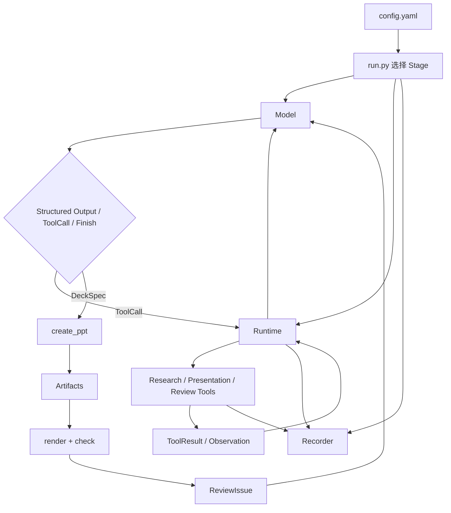

# 中国大陆消费端 AI 助手调研 PPT Agent：精简实现计划

## 1. 目标与范围

本项目用于商科 PhD Workshop，以同一个任务展示普通 LLM 程序如何逐步演化为 Agent。Demo 的重点是让听众看清：

```text
模型输出什么 → 谁决定下一步 → 调用了什么工具 →
环境返回什么 → 状态如何变化 → 为什么继续或结束
```

统一任务为：

> 截至配置中指定的数据截止日期，为商科研究生制作一份 5 页中文 PPT，分析中国大陆消费端通用 AI 助手的竞争格局及最近 12 个月的变化。

研究对象限定为面向中国大陆普通消费者、以独立移动 App 为主要入口的通用 AI 助手。排除企业 API、云服务市场、办公软件或手机系统内置功能，以及主要服务海外市场的产品。按最新可比数据选择用户规模领先的 5–6 款产品，不在代码中写死名单。

用户规模优先使用 MAU。进入同一图表的数据必须尽量保持来源、地区、终端范围和指标口径一致。若展示份额，只能使用：

```text
样本内 MAU 份额 = 某产品 MAU ÷ 所选产品 MAU 总和
```

图表必须写明“样本内 MAU 份额”，并说明用户可能同时使用多个 App。MAU、DAU、下载量、访问量或全球数据不得在同一趋势图中直接比较。无法获得同口径数据时保留缺口，不推测或补造。

五页固定结构如下：

| 页码 | 内容 | 最低要求 |
| --- | --- | --- |
| 1 | 范围、口径与核心结论 | 数据截止日期、研究对象、3 条发现 |
| 2 | 最新竞争格局 | 同口径 MAU、样本内份额、来源 |
| 3 | 最近 12 个月变化 | 至少 3 个可比时间点，缺失时明确说明 |
| 4 | 产品定位与优劣势 | 5–6 款产品的证据化对比 |
| 5 | 趋势、商业启示与局限 | 竞争趋势、商业含义、数据限制 |

第一页兼作标题页，不另设纯封面。

### 本轮只实现的关键能力

- 单次模型调用与结构化输出；
- Tool Calling，以及搜索、网页读取和 PPT 构建；
- 固定 Workflow 与自主 Agent Loop 的对比；
- 最小显式 State，以及独立的 Planning 和 Re-planning；
- PPT 渲染、规则检查和一次可观察的修订循环；
- 运行轨迹和阶段产物保存。

### 明确不进入主 Demo 的内容

- Multi-Agent 和 Agent 框架迁移；
- 跨任务长期记忆、向量数据库；
- 图片生成、自动设计模板、复杂动画；
- Web UI、并发、自动重试、故障恢复和生产级权限系统；
- 代码 Agent 和论文修改 Agent 的实际工程。

这些内容可以在课程结尾作为扩展方向讲解，但不为它们预留空模块，避免架构先于需求膨胀。

## 2. 阶段重新划分

阶段按“新增的控制机制”划分，而不是按最终产物划分。每个阶段只引入一个主要新概念；后续阶段可复用前一阶段已有能力。

| 阶段 | 名称 | 新增机制 | 谁决定下一步 | 主要产物 |
| --- | --- | --- | --- | --- |
| S0 | API | 一次普通模型调用 | 宿主程序 | `draft.md` |
| S1 | Structured Output | 受约束的 `DeckSpec` JSON | 宿主程序 | `deck.json`，**不生成 PPT** |
| S2 | Tools | Tool schema、模型发起调用、runtime 执行并回传 | 模型决定调用哪个工具；宿主限制为教学回合 | 工具轨迹、示例 `.pptx` |
| S3 | Workflow | 固定的调研与制作为序 | 代码预先写死 | 来源、证据、完整 `.pptx` |
| S4 | Agent Loop | 根据 Observation 重复选择 Action 或 Finish | 模型 | 自主检索轨迹、完整 `.pptx` |
| S5 | State | 将执行事实整理为显式任务状态 | runtime 依据真实结果更新 | `state.json`、完整 `.pptx` |
| S6 | Planning | 生成任务计划，并依据证据缺口 Re-plan | 模型提议，runtime 校验并落盘 | `plan.json`、计划变更、完整 `.pptx` |
| S7 | Reflection | 渲染、检查、修订、再次检查 | 模型根据外部反馈选择修订动作 | 修改前后 PPT、检查报告 |

这解决了原方案中 V1 和 V2 的重叠：

- S1 只负责“模型输出可被程序解析的数据”，到 `deck.json` 为止；
- PPT 构建是外部可执行能力，统一定义为 `create_ppt` 工具，从 S2 才首次出现；
- 搜索和网页读取同样属于 Tool 层，不再为“PPT 工具”和“研究工具”分别创造版本；
- Tool 与 Tool Calling 要区分：Tool 是可调用函数，Tool Calling 是模型生成调用请求、runtime 执行并回传的协议；
- 同一个 Tool 在 S3 可由固定 Workflow 调用，在 S4–S7 可由模型选择调用。区别是控制权，不是函数本身。

### S0：普通 API

输入完整任务和研究规则，只调用模型一次，保存五页文字草稿。不给模型工具，也不要求 JSON。

```text
config.task → LLM → draft.md
```

该阶段故意暴露单次生成的限制：可能没有真实检索、来源陈旧或统计口径混杂。它不生成 PPT。

验收：请求、响应和 `draft.md` 均被保存，日志中没有工具事件。

### S1：Structured Output

把 S0 的自由文本输出替换为 `DeckSpec`，由模型接口执行 schema 校验。该阶段在 JSON 保存成功后立即结束。

```text
config.task → LLM structured output → validate → deck.json
```

最小 `DeckSpec`：

```json
{
  "title": "中国大陆消费端 AI 助手竞争格局",
  "slides": [
    {
      "id": "s1",
      "title": "范围、口径与核心结论",
      "bullets": ["研究对象为中国大陆独立移动端通用 AI 助手"],
      "source_ids": [],
      "speaker_notes": "解释 MAU 与样本内 MAU 份额"
    }
  ]
}
```

实际必须有且仅有五页，并使用稳定页面 ID。S1 不调用 `create_ppt`，这样“结构化输出”和“外部执行”在教学上有明确边界。

验收：`deck.json` 通过 schema 校验；运行目录中不存在 `.pptx`。

### S2：Tools

首次引入统一的 Tool 层：工具描述、`ToolCall`、参数校验、执行分派、`ToolResult` 和调用 ID 对应。只做两个短而固定的教学回合，不实现自主循环：

1. 研究回合：模型提出一个 `search_web` 调用，runtime 执行并把结果回传给模型；
2. 制作回合：模型生成符合 `DeckSpec` 的 `create_ppt` 调用，runtime 执行并返回文件路径。

首批工具只有三个：

| 工具 | 输入 | 输出 | 用途 |
| --- | --- | --- | --- |
| `search_web` | 查询词、可选日期范围 | 标题、URL、摘要 | 找候选来源 |
| `read_page` | URL | 标题、正文、发布日期 | 核对原文和口径 |
| `create_ppt` | `DeckSpec` | `.pptx` 路径 | 把页面结构写成文件 |

S2 的固定教学脚本负责何时开始和何时结束回合；模型只决定工具名和参数。因此它展示 Tool Calling，但还不是可以持续自主决策的 Agent。

验收：事件日志能按同一调用 ID 展示“模型请求 → runtime 执行 → 结果回传”；实际生成一个 `.pptx`。

### S3：固定 Workflow

复用同一组工具，但由 Python 按预定顺序调用：

```text
搜索最新排名
→ 选取 5–6 个候选产品
→ 搜索并阅读最新 MAU 与历史数据
→ 检查地区、终端、指标和时间口径
→ 搜索产品定位资料
→ 整理 Evidence
→ 模型生成 DeckSpec
→ create_ppt
```

模型可以完成局部提取或写作，但搜索轮数、阶段顺序、何时进入 PPT 制作均由代码决定。资料不足时记录缺口，不临时改变流程。

验收：能够独立运行得到来源、证据、五页 JSON 和 PPT；执行顺序与代码定义一致。

### S4：Agent Loop

用一个最小循环替换 S3 的固定编排：

```text
读取目标、已有证据和最近一次观察
→ 模型返回 ToolCall 或 Finish
→ runtime 执行并记录 Observation
→ 回到模型
→ 完成或达到限制后退出
```

模型可自主调用 `search_web`、`read_page` 和 `create_ppt`。runtime 只负责 schema 校验、工具执行、事件记录和停止条件，不用针对具体产品写补搜分支。

需要展示的关键轨迹是：模型看到数据口径冲突或缺失后，改变下一次搜索、缩小比较范围或明确保留缺口。录制时选取一条真实而清楚的轨迹，不宣称单次案例能证明平均质量提升。

验收：至少出现一次“Observation 改变后续 Action”的真实记录；结束原因明确为 `completed`、`limit_reached` 或 `error`。

### S5：显式 State

在 S4 循环基础上增加最小 `TaskState`，不实现跨任务长期记忆。State 由 runtime 根据真实的模型响应、工具结果和产物更新；模型可以建议更新，但不能自行宣告未执行的动作已经完成。

```text
TaskState
  goal
  metric_scope
  selected_products
  evidence
  open_questions
  current_deck
  current_step
  termination_reason
```

每轮只向模型提供当前任务需要的状态、相关证据和近期观察，不再无限追加完整消息历史。原始消息仍写入运行目录供回放。

验收：`state.json` 随真实执行结果变化；能够从日志追溯每个关键状态字段的来源。

### S6：Planning 与 Re-planning

在 S5 的 State 上单独增加 `Plan`：

```text
PlanItem
  id
  objective
  depends_on
  status
  required_evidence
```

模型在执行前生成计划；每轮上下文加入当前计划。模型可提出计划变更，runtime 检查引用的步骤和证据是否存在后再写入 `plan.json`。

演示情节：原计划准备用单一来源绘制 12 个月趋势，阅读后发现统计范围改变；Agent 更新计划，改找同口径来源，仍无法补齐时调整图表范围并保留数据缺口。

验收：保存初始计划和至少一次有 Observation 依据的计划更新；不能只有措辞变化而执行路径不变。

### S7：Reflection 与修订

在 S6 完成初版 PPT 后加入以下工具：

| 工具 | 输入 | 输出 |
| --- | --- | --- |
| `render_ppt` | PPT 路径 | 每页图片路径 |
| `check_deck` | `DeckSpec`、Evidence、渲染信息 | 结构化 `ReviewIssue[]` |
| `patch_deck` | `DeckPatch` | 更新后的 `DeckSpec` |

`check_deck` 首先执行确定性检查：页数、页面 ID、文字量、来源引用、MAU 标签、统计口径和版面越界。视觉语义检查若调用多模态模型，必须在日志中标为模型判断，不能当作客观真值。

Agent 根据 `ReviewIssue` 选择补搜、修改页面或说明问题无法解决；修改后重新执行 `create_ppt → render_ppt → check_deck`。最多修订配置中规定的轮数。

验收：至少保留一条“检查发现问题 → 采取行动 → 产物变化 → 再次检查”的真实轨迹，以及修改前后两个 PPT 版本。

## 3. 精简后的目录结构

项目文档可以留在仓库根目录和 `doc/`，但 **Demo 的代码、配置、静态输入和运行产物全部位于 `src/`**。不再使用 `demo/src/` 的双层目录。

```text
plan.md
doc/
  历史交互总结.md
src/
  run.py                       # 唯一入口：python src/run.py
  config.yaml                  # 唯一业务配置文件
  requirements.txt
  core/
    .env                        # 本机 URL/Key；被 Git 忽略
    .env.example                # 可提交的 URL/Key 模板
    config.py                  # 加载、校验配置，解析相对路径
    context.py                 # 一次运行共享的来源、产物、State 和 Plan
    contracts.py               # 所有共享数据结构
    model.py                   # 单一模型接口与响应适配
    runtime.py                 # 工具注册/执行、Agent Loop、停止条件
    recorder.py                # events.jsonl 和产物索引
  stages/
    s0_api.py
    s1_structured.py
    s2_tools.py
    s3_workflow.py
    s4_agent.py
    s5_state.py
    s6_planning.py
    s7_reflection.py
  tools/
    research.py                # search_web、read_page
    presentation.py            # create_ppt、render_ppt、patch_deck
    review.py                  # check_deck
  assets/
    template.pptx
  runs/
    .gitkeep
    <run_id>/
      config.snapshot.yaml
      events.jsonl
      result.json
      sources.json
      evidence.json
      state.json               # 仅 S5+ 生成
      plan.json                # 仅 S6+ 生成
      deck_v1.json
      deck_v1.pptx             # 仅 S2+ 可能生成
      slides_v1/               # 仅 S7 生成
      review_v1.json           # 仅 S7 生成
      deck_v2.json             # 发生修订时生成
      deck_v2.pptx
      slides_v2/
      review_v2.json
```

架构约束：

- `stages/` 只负责各阶段控制流，不复制模型、工具或数据结构；
- `tools/` 中的函数只完成一次外部动作，不在内部启动 Agent Loop；
- `runtime.py` 是唯一的工具分派和循环实现，S2 与 S4–S7 复用它；
- `contracts.py` 是跨阶段唯一契约来源，避免各版本拥有不兼容 JSON；
- 所有相对路径均以 `src/` 为基准，不依赖执行命令时的当前目录；
- 每次运行创建新目录，禁止静默覆盖之前的录屏素材；
- 每个阶段可独立运行，不要求先执行前一阶段。

## 4. 单配置文件与零参数入口

用户只执行：

```bash
python src/run.py
```

`run.py` 固定读取同目录的 `config.yaml`，不要求任何命令行参数。切换阶段、模型、任务日期、工具服务、执行限制和输出位置都通过该文件完成。

建议配置结构：

```yaml
run:
  stage: s4_agent
  output_dir: runs
  run_name: china_ai_landscape

model:
  active_profile: deepseek
  env_file: core/.env
  profiles:
    deepseek:
      name: deepseek-chat
      api_key_env: DEEPSEEK_API_KEY
      base_url_env: DEEPSEEK_BASE_URL
      supports_json_object: true
      supports_tool_calling: true
    third_party:
      name: your-model-name
      api_key_env: THIRD_PARTY_API_KEY
      base_url_env: THIRD_PARTY_BASE_URL
      supports_json_object: true
      supports_tool_calling: true
  temperature: null
  max_output_tokens: 8000
  timeout_seconds: 120

task:
  language: zh-CN
  audience: 商科研究生
  data_cutoff_date: 2026-09-09
  lookback_months: 12
  slide_count: 5
  market: 中国大陆消费端通用 AI 助手
  product_count_min: 5
  product_count_max: 6
  primary_metric: MAU
  require_same_scope_for_chart: true
  allow_missing_data: true
  slide_outline:
    - 范围、口径与核心结论
    - 最新竞争格局
    - 最近 12 个月变化
    - 产品定位与优劣势
    - 趋势、商业启示与局限

research:
  search_provider: tavily
  search_api_key_env: TAVILY_API_KEY
  max_results_per_query: 5
  preferred_domains: []
  blocked_domains: []

presentation:
  template: assets/template.pptx
  output_filename: china_ai_landscape.pptx
  font_family: Noto Sans CJK SC
  render_dpi: 144

limits:
  max_model_calls: 20
  max_tool_calls: 30
  max_agent_steps: 15
  max_review_rounds: 2
  max_elapsed_seconds: 900

review:
  max_bullets_per_slide: 6
  max_chars_per_slide: 260
  require_source_for_numeric_claim: true
  require_metric_scope_label: true

recording:
  save_messages: true
  save_tool_payloads: true
  save_config_snapshot: true
```

所有会改变行为的非敏感输入都必须进入 `config.yaml`，不得散落为 `run.py` 常量或第二个 task 文件。模型 URL 与 Key、搜索 Key 是唯一例外：统一放在被 Git 忽略的 `src/core/.env`，仓库只提交 `src/core/.env.example`。配置用 `active_profile` 在 DeepSeek 与第三方 OpenAI-compatible API 间切换，执行时仍然只需 `python src/run.py`。

启动时 `config.py` 必须：

1. 检查 `stage` 是否属于 S0–S7；
2. 校验日期、页数、产品数量范围和各类限制；
3. 将 `assets/`、`runs/` 等相对路径解析为 `src/` 下的绝对路径；
4. 加载 `core/.env`，检查 active profile 所需的 URL、Key、工具能力及当前阶段的其他凭据；
5. 在创建运行目录后保存 `config.snapshot.yaml`，保证录屏结果可复现。

配置错误应在任何模型调用或文件生成前直接失败，并给出明确字段路径。

## 5. 核心数据契约

只保留下列共享对象：

| 对象 | 最少字段 | 作用 |
| --- | --- | --- |
| `TaskSpec` | 截止日期、回溯期、市场范围、指标规则、五页结构 | 由 `config.task` 构造统一任务 |
| `ToolCall` | 调用 ID、工具名、参数 | 表示模型的工具请求 |
| `ToolResult` | 调用 ID、成功/失败、数据、产物路径 | 对应一次实际执行 |
| `Source` | ID、URL、标题、发布日期、抓取时间、正文路径 | 保存原始来源 |
| `Evidence` | ID、论断、产品、指标、数值、单位、统计期、地区、终端、来源 ID、支持片段 | 支撑定量和定性内容 |
| `DeckSpec` | 标题、五个稳定页面 ID、要点、图表数据、来源 ID、备注 | 生成 PPT |
| `TaskState` | 已选产品、证据、缺口、当前产物、当前步骤、结束原因 | S5+ 的显式状态 |
| `Plan` | 步骤、依赖、状态、完成所需证据 | S6+ 的计划与更新 |
| `ReviewIssue` | 页面 ID、类型、严重程度、证据、建议 | S7 的可执行反馈 |
| `DeckPatch` | 页面 ID、字段变更、原因、关联问题 ID | 记录局部修订 |
| `RunEvent` | 时间、阶段、事件类型、调用 ID、摘要、文件引用 | 回放完整过程 |

`Evidence` 是否可比较由确定性函数判断，至少比较 `metric`、`period`、`geography` 和 `platform`；不能让模型仅凭文字判断后直接把数字放进同一图表。

## 6. 控制流与职责边界



边界原则：

- Model 生成内容或提出动作，不直接执行网络和文件操作；
- Runtime 校验并执行 ToolCall，不修改工具返回的事实；
- Tool 返回一次动作结果，不决定后续步骤；
- Stage 决定控制权属于固定代码还是 Agent Loop；
- Recorder 只记录，不参与业务判断；
- S7 中检查结果回到循环后，是否补搜或修改由 Agent 决定。

## 7. 实施顺序

| 里程碑 | 范围 | 完成标志 |
| --- | --- | --- |
| M1 | 配置、契约、模型接口、Recorder、S0–S1 | 单命令可分别得到文本或合法五页 JSON |
| M2 | Runtime、三项工具、S2 | 可看到完整 ToolCall/ToolResult，并生成示例 PPT |
| M3 | 证据整理、可比性检查、S3 | 固定流程生成带来源的完整 PPT |
| M4 | S4 | 出现基于观察改变动作的真实 Agent 轨迹 |
| M5 | S5 | 状态可落盘，每个关键字段可追溯到执行事件 |
| M6 | S6 | 计划可落盘，至少发生一次有依据的 Re-plan |
| M7 | 渲染、检查、Patch、S7 | 保存修改前后 PPT 和两次检查结果 |
| M8 | 素材整理 | 从 `events.jsonl` 提取截图和录屏所需时间线 |

首个课堂可用里程碑是 M4；完整主 Demo 是 M7。M1–M7 完成前不增加扩展模块。

## 8. 验证与课堂素材

### 自动检查

- 从仓库根目录执行 `python src/run.py`，不传参数；
- 配置中的每个相对路径最终都位于 `src/`；
- S1 只生成 `deck.json`，不生成 PPT；
- S2 日志中 ToolCall 与 ToolResult 的调用 ID 一一对应；
- PPT 恰好五页，页面 ID 唯一且顺序固定；
- 样本内 MAU 份额计算正确，图表标签完整；
- 同一趋势图中的 Evidence 通过口径可比性检查；
- 每个关键数字能追溯到来源、统计期和支持片段；
- 达到步数、工具次数、模型次数、修订次数或总时间限制时能正确结束；
- S7 的 `DeckPatch` 确实改变目标页面，并保留旧版本。

### 人工检查

- 产品是否符合“中国大陆独立移动端通用 AI 助手”的范围；
- 优劣势是否有证据，而非把底层模型能力直接等同于产品竞争力；
- 数据缺口和口径限制是否诚实披露；
- 页面是否清晰可读；
- 自主补搜和重新规划是否真的由观察触发，而不是隐藏的硬编码。

### 最少录屏素材

| 对比 | 展示内容 |
| --- | --- |
| S0 → S1 | 自由文本与可校验 JSON |
| S1 → S2 | JSON 本身不会执行；ToolCall 才实际生成 PPT |
| S2 → S3 | 单次工具协议与固定多步骤 Workflow |
| S3 → S4 | 口径冲突后，固定路线与自主下一步的区别 |
| S4 → S5 | 原始消息历史与显式 State 的区别 |
| S5 → S6 | 隐式行动与可观察的 Plan/Re-plan 的区别 |
| S6 → S7 | 问题页、检查结果、修订动作和修改后页面 |

最终应让听众明确看到：结构化输出解决“程序如何读懂结果”，Tool Calling 解决“模型如何请求外部执行”，Workflow 和 Agent Loop 的差别在“谁决定下一步”，State/Planning 解决长任务进度管理，Reflection 则利用可观察反馈改变产物。
